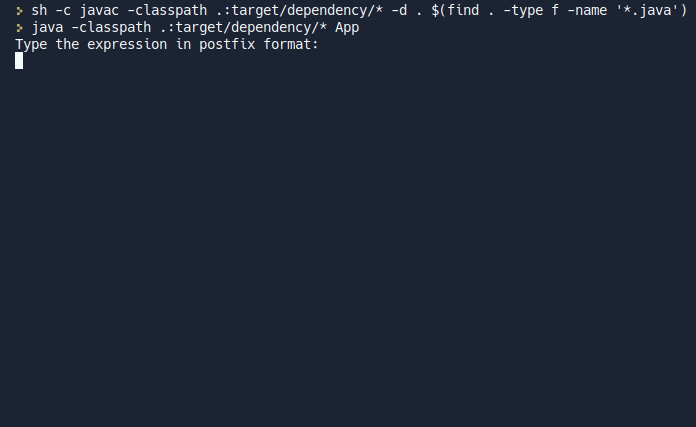

# Postfix Expressions Solver

**Postfix algorithm** is a command-line interface program written in Java. It aims to simply solve an algebraic expression in postfix format (inverse Polish notation) and return the result.

This was an exercise proposed during Data Structure class of the Computer Science course.

# How it works?

Provide an expression in postfix format, something like:

- `3 3 + 2 /`
- `5 2 3 + * 2 / 1 -`
- `2 5 + 3 * 4 3 + 5 * + 2 4 + 7 * 8 + + `

# Getting started

~~~bash
git clone https://github.com/lucasferreiraz/postfix-algorithm.git

cd postfix-algorithm/

java -jar postfix-algorithm.jar
~~~

## Or try it [online via repl.it](https://replit.com/@LucasFerreira67/postfix-algorithm)

